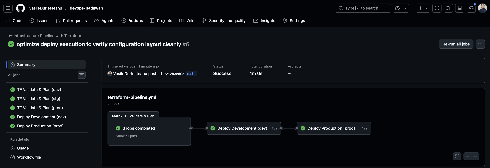
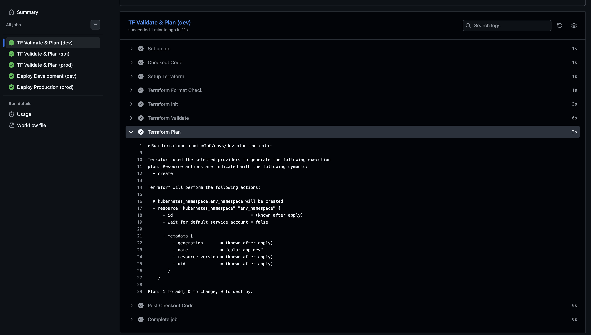
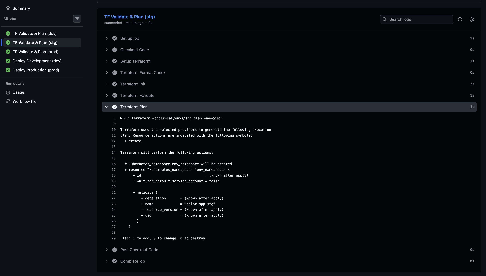
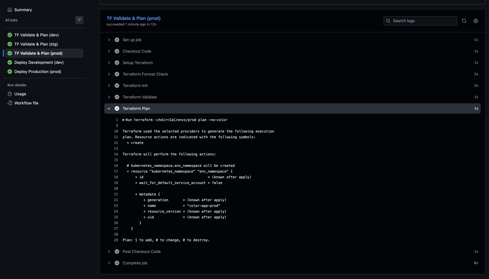
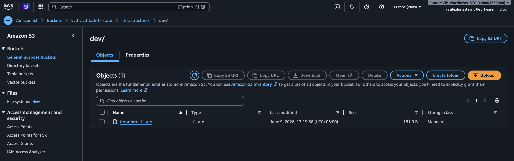

# Task 2: Infrastructure Pipeline with Terraform (IaC)

This workspace automates the linting, validation, and simulated deployment lifecycle of multi-environment infrastructure configurations utilizing a matrix-driven GitHub Actions architecture.

**Isolated Code Workspace:** [VasileDurlesteanu/devops-padawan](https://github.com/VasileDurlesteanu/devops-padawan)

---

## Pipeline Execution Evidence

