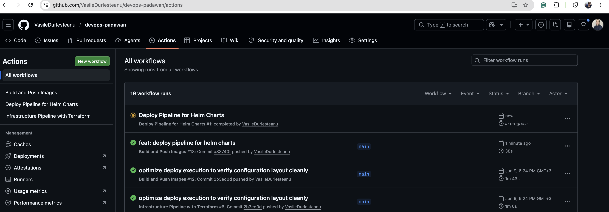
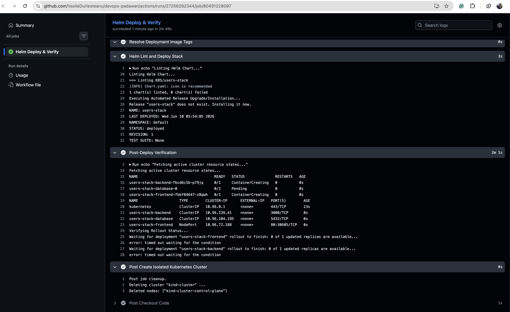
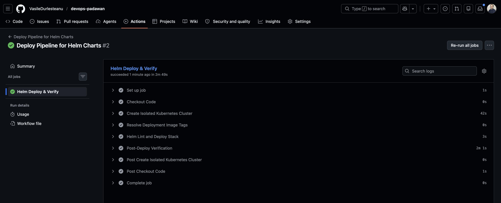

# Task 3: Deploy Pipeline for Helm Charts

This pipeline automates application delivery to Kubernetes by packaging color-app frontend, backend, and database tiers into unified Helm charts, orchestrating deployments through GitHub Actions.

---

**Isolated Code Workspace:** [VasileDurlesteanu/devops-padawan](https://github.com/VasileDurlesteanu/devops-padawan)

---

## Pipeline Execution Evidence

